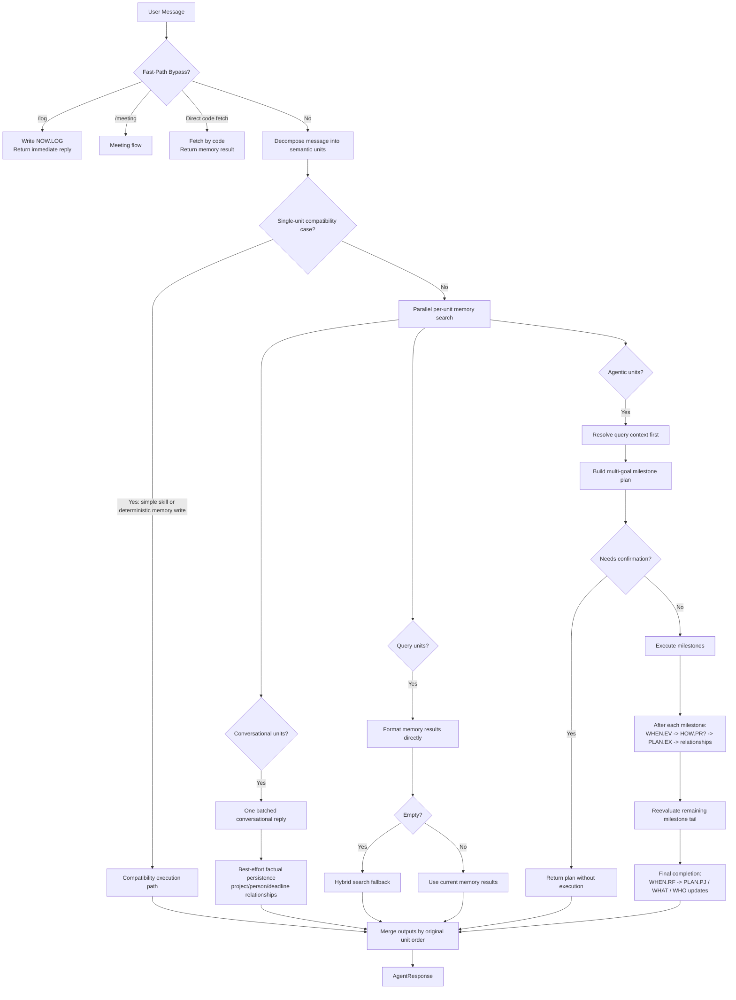

# AgenticAGI — Current Architecture

> Based on the actual runtime after the decomposition-first Phase 13 redesign, the subsequent hardening fixes, and the Phase 14 local UI.

---

## 1. System Summary

AgenticAGI is a local-first TypeScript/Node agent with:

- persistent markdown-based memory
- SQLite indexing and retrieval
- decomposition-first routing
- milestone-based planning and execution
- request-scoped LLM runtime selection
- both CLI and local web UI entrypoints

The important architectural change is this:

- the system no longer decides a single top-level intent before understanding the message
- the message is decomposed first
- routing happens from the decomposed units

Legacy intent labels still exist in a narrow compatibility layer for tests, metadata, and a few simple direct flows, but they are not the primary runtime architecture.

### Logical Runtime Map



---

## 2. Runtime Surfaces

There are two user-facing runtime surfaces:

### CLI

`chat.ts`

- starts the agent
- initializes the database
- maintains short in-memory conversation history
- surfaces active `PLAN.EX` state on startup
- optionally renders transparency events when `TRANSPARENT=true`

### Web UI

`server/ui-server.ts` + `public/index.html`

- serves a single-file local chat UI
- opens a WebSocket bridge to `processMessage()`
- streams transparency events live
- renders plan and milestone state in the browser
- supports request-scoped provider switching:
  - `local` = LM Studio primary, Gemini fallback
  - `cloud` = Gemini primary, LM Studio fallback

---

## 3. Request Lifecycle

The main request entrypoint is `processMessage()` in `core/agent.ts`.

The current runtime flow is:

```text
User message
  -> fast-path bypass check
  -> decomposition
  -> parallel per-unit memory search
  -> route execution
  -> merge replies by original unit order
  -> AgentResponse
```

### 3.1 Fast-path bypasses

These run before decomposition and skip the normal routing pipeline:

- `/log ...` -> immediate `NOW.LOG` write
- `/meeting` -> meeting flow
- direct code fetch messages -> direct memory fetch path

These are TypeScript-level deterministic bypasses.

### 3.2 Decomposition

`core/decomposition.ts`

The LLM returns structured semantic units:

```ts
type RouteKind = 'conversational' | 'agentic' | 'query';

interface DecomposedUnit {
  id: string;
  route: RouteKind;
  content: string;
  order: number;
}
```

The decomposition layer is hardened:

- first pass asks for structured unit decomposition
- if the message looks compound but under-splits, it retries with a stricter prompt
- if that still fails, a narrow heuristic repair pass tries to recover obvious compound structure
- if all else fails, it falls back to one safe unit containing the original message

The fallback preserves meaning instead of dropping content.

### 3.3 Parallel unit memory search

`core/memory/unit-search.ts`

Every decomposed unit is searched in parallel with `Promise.all`.

Search priority is:

1. person signal
2. project signal
3. time signal
4. procedure signal
5. BM25 fallback
6. vector fallback only when BM25 confidence is low

Hardening added after the Phase 13 audit:

- person detection no longer mistakes sentence-start command words like `Create` or `Remember` for names
- if person/project/procedure signal search finds no matching entries, the system now falls through to BM25/vector fallback instead of returning empty direct-hit context

### 3.4 Route execution

`core/router.ts`

Units are grouped by route:

- conversational units -> one shared conversational call
- query units -> direct retrieval formatting, broader hybrid search only when needed
- agentic units -> one multi-goal plan

Query units are resolved before agentic planning and their results are injected into the planner as context. They are not treated as goals.

### 3.5 Reply merge

The router returns reply parts keyed by unit order.

Merge rules:

- conversational reply covers all conversational units together
- agentic reply covers all agentic units together
- query replies are per query unit

The final user reply is the concatenation of these parts in original message order.

---

## 4. Decomposition-First Routing vs Legacy Compatibility

The runtime source of truth is decomposition, not `classifyIntent()`.

### What was removed as primary runtime architecture

These are no longer top-level routing branches:

- greeting as a primary intent router
- `synthesis_query` as a top-level execution path
- `relationship_write` as a top-level execution path
- classifier-first “pick one intent then route everything through it”

### What still exists

`core/intent.ts` still exists as a compatibility shim.

It is now used only for:

- legacy tests
- metadata mapping on responses
- a narrow single-unit compatibility path for a few simple direct flows

That compatibility path is intentionally limited to non-compound, single-unit cases such as:

- direct `run_bash`
- direct `file_writer`
- direct `web_search`
- direct `calculator`
- deterministic memory writes

If decomposition succeeds, decomposed units are the routing authority.

---

## 5. Memory Architecture

### 5.1 Notebook model

All durable memory belongs to one of these notebooks:

| Notebook | Purpose | Common Types |
|----------|---------|--------------|
| `WHO` | people and organizations | `CT`, `ORG` |
| `WHAT` | projects and knowledge | `PJ`, `KN` |
| `WHEN` | time-based memory | `CA`, `DL`, `EV`, `RF`, `HX` |
| `HOW` | procedures and skills | `PR`, `SK` |
| `WHY` | meta reasoning and open questions | `MT`, `QU` |
| `NOW` | active current-state memory | `TD`, `RP`, `LOG` |
| `PLAN` | planning and execution state | `PL`, `EX`, `CT`, `MS`, `PJ` |

### 5.2 Code format

Every memory entry has a stable code:

```text
{NOTEBOOK}.{TYPE}-{SEQUENCE}
```

Example:

```text
WHO.CT-000001
PLAN.EX-000042
```

Codes are generated from SQLite counters and used everywhere as the canonical internal identifier.

### 5.3 Files are truth, SQLite is the map

Canonical content is stored in markdown files on disk.

SQLite stores:

- metadata
- code/name/type/status/path
- due dates
- search indexes
- relationship edges
- chunk vectors
- counters and settings

### 5.4 Write order and integrity

`core/memory/write.ts`

Current write discipline is file-first:

- `createEntry()` writes markdown first, then SQLite/indexes
- if SQLite fails after the file write, the file is cleaned up
- `upsertEntry()` rewrites markdown first, then updates SQLite
- if SQLite update fails during upsert, the markdown file is rolled back

Hardening added after the audit:

- frontmatter now stays aligned with SQLite for `status`, `summary`, `updated`, `path`, and `due_date`
- missing markdown files are recreated before SQLite is updated
- atomic `.tmp -> rename` writes are used for markdown changes

### 5.5 Bootstrapping

`core/memory/index.ts`

If SQLite is empty, the agent can rebuild the index from markdown files by scanning `memory/`, parsing frontmatter, and reconstructing metadata/search indexes.

That is why markdown remains the source of truth.

---

## 6. Memory Retrieval

There are now two retrieval layers.

### 6.1 Primary query path

Primary runtime query handling is in:

- `core/memory/unit-search.ts`
- `core/router.ts`

For decomposed query units:

- use signal-based scoped lookup
- if results exist, format them directly
- if empty, run broader hybrid search
- do not invoke the planner

This is the normal query architecture now.

### 6.2 Legacy resolver path

`core/resolver.ts`

The old 5-step resolver still exists and is used by compatibility flows like:

- direct code fetch
- some legacy memory query paths
- relationship query compatibility

It escalates through:

1. direct code lookup
2. filter query
3. relationship traversal
4. fuzzy name lookup
5. hybrid search fallback

This is no longer the main query path for decomposed messages, but it still exists as infrastructure for older paths.

### 6.3 Hybrid search

`core/memory/search.ts`

Hybrid search combines:

- BM25 via FTS5
- vector similarity when embeddings are available
- reciprocal rank fusion

If embeddings are unavailable or the embedding model is down, retrieval degrades safely to BM25-only mode.

---

## 7. Conversational Route

Conversational units are handled together in `core/router.ts`.

Behavior:

- all conversational units in one message are answered in one LLM call
- arithmetic units may use the calculator first, then fold the result into the shared conversational prompt
- there is no planner involvement

### Factual conversational persistence

After the conversational reply is assembled, the router runs a best-effort TypeScript inference pass over conversational units and may persist:

- project starts -> `WHAT.PJ`
- person-role facts -> `WHO.CT`
- project/person relationships -> relationship edges
- deadlines -> `WHEN.DL`

Important:

- this does not block the reply
- it does not invoke another LLM call
- it is pattern-based and best-effort

This was added specifically to stop compound messages from losing conversational facts after the agentic/query portions completed.

---

## 8. Agentic Planning and Execution

### 8.1 Planner

`core/planner.ts`

Agentic units become goals.

The planner receives:

- agentic goals only
- decomposition summary
- per-unit memory context
- prior query results resolved earlier in the same message
- skill descriptions

The planner returns a milestone-aware `TaskPlan`.

### 8.2 Task plan structure

`core/schemas.ts`

Current plan shape includes:

- `goal`
- `goals[]`
- `milestones[]`
- flattened `steps[]` compatibility view
- `complexity`
- `needsConfirmation`
- `estimatedDuration`

All plans now use milestones.

Rules:

- `LOW` complexity -> exactly one milestone
- `MEDIUM/HIGH/MAX` -> explicit milestone structure when the work meaningfully spans multiple checkpoints

### 8.3 Executor

`core/executor.ts`

Execution is milestone-first:

```text
for each milestone:
  emit milestone_start
  run steps in order
  abort on required-step failure
  run post-milestone memory cycle
  emit milestone_result
  reevaluate remaining milestone tail
```

### 8.4 Milestone reevaluation

`reviseRemainingMilestones()`

This is now a real LLM-backed revision pass, not a stub.

Constraints:

- completed milestones are immutable
- only remaining milestones can change
- revision failure never aborts the plan
- revised milestones preserve executable step tails instead of dropping them when milestone ids change

This preservation logic was added during the audit hardening pass.

### 8.5 Verification and reporting

After execution:

- `verifyExecution()` performs an LLM-based verification pass
- `buildUserReport()` formats the final user report

Verification is still advisory. The system tries to ground success in actual step outcomes, but the report layer is still a summarization layer over execution state, not a formal proof system.

---

## 9. PLAN.EX Execution State

`core/memory/plan-ex.ts`

`PLAN.EX` is the persisted state machine for planned execution.

### Status model

- `active`
- `in_progress`
- `paused`
- `complete`
- `failed`

Only these are treated as resumable on load:

- `active`
- `in_progress`
- `paused`

Terminal states:

- `complete`
- `failed`

### Startup behavior

Both CLI and UI surface resumable plans on startup:

- paused plans show the pause reason
- active/in-progress plans show the next milestone/action

This was hardened after a real accumulation bug where completed plans kept resurfacing as active.

### Milestone boundary updates

At each completed milestone, the executor updates `PLAN.EX` with:

- completed milestone ids
- next milestone id
- checkpoint timestamp
- linked codes

At final completion, it persists `complete`.

On failure, it persists `failed`.

---

## 10. Post-Milestone Memory Cycle

After each completed milestone, the executor runs a write cycle:

1. write `WHEN.EV`
2. optionally write `HOW.PR`
3. update `PLAN.EX`
4. infer/write relationships

After final completion:

1. write `WHEN.RF`
2. update matching `PLAN.PJ` summary when relevant
3. extract durable facts where justified

Relationship inference during milestone writes is best-effort and uses existing codes rather than speculative free text.

---

## 11. Skills

`core/skills/registry.ts`

The runtime uses MCP-style skills. Built-in tools are registered centrally and invoked by planner steps or by the narrow compatibility path.

Important current skills include:

- `calculator`
- `file_reader`
- `file_writer`
- `run_bash`
- `web_search`
- `memory_read`
- `memory_write`
- `content_writer`
- `web_fetch`
- `url_extract`
- `relationship_write`
- `implement_and_test`
- `memory_history`
- `verify_state`

### `implement_and_test`

This skill is now significantly hardened:

- reuses existing workspace files when present
- syntax-checks both implementation and tests
- repairs both artifacts, not just code
- installs detected npm dependencies automatically inside the real project directory
- handles nested workspace paths correctly
- supports scoped package normalization

This is now the primary coding loop skill for “build/fix/test” style tasks.

### Read-only deterministic skills

Some direct compatibility flows return their actual output directly instead of asking the LLM to paraphrase the result. This prevents fake completion text such as “Let me search for you” after the skill already ran.

---

## 12. Context and LLM Runtime

### 12.1 Context builder

`core/context.ts`

`buildContext()` assembles:

- system prompt
- assistant identity and behavior rules
- ranked resolved memory
- active constraints
- optional skill output
- rolling conversation summary when needed
- recent conversation history
- current user request

The assistant identity is fixed in prompt context as `zaraban`.

### 12.2 Token controls

Context assembly uses:

- token budgeting
- rolling summarization
- staged truncation when needed

This keeps long-running sessions from exploding prompt size.

### 12.3 LLM runtime selection

`core/llm.ts`

Provider selection is request-scoped via `AsyncLocalStorage`.

That matters because nested calls inside:

- planner
- executor
- content generation
- `implement_and_test`

all inherit the same provider runtime for that request.

### 12.4 Response cleaning

`stripThinkingTags()` now strips only unambiguous reasoning artifacts such as:

- `<think>...</think>`
- `<thought>...</thought>`
- LM Studio special tokens

It no longer strips ordinary visible content based on fragile text heuristics.

---

## 13. Transparency

`core/transparency.ts`

Transparency is a typed event bus shared across the runtime.

Important current events include:

- `decomposition`
- `unit_memory_search`
- `complexity`
- `plan`
- `step_start`
- `step_result`
- `llm_request`
- `llm_raw`
- `llm_stripped`
- `milestone_start`
- `milestone_result`
- `milestone_revised`
- `milestone_memory_cycle`
- `memory_write`
- `failure_classified`

This powers:

- CLI transparency rendering
- web UI live thinking panel
- web UI plan diagram updates

The milestone revision event now carries revision metadata like milestone id, revised count, and reason.

---

## 14. Background Systems

### Heartbeat

`core/heartbeat.ts`

Background health checks scan for:

- upcoming deadlines
- overdue todos/plans
- stale questions
- stale projects
- stale project brains
- weak vision alignment

Findings are written to memory and queued for later surfacing.

### Memory versioning

`core/memory/versioning.ts`

Memory writes trigger git-backed version commits on a best-effort basis. Failures are logged but do not block the write path.

### Lifecycle enrichment

`core/memory/lifecycle.ts`

Post-write enrichment can extract metadata such as importance and atomic facts asynchronously.

---

## 15. Current File Map

| File | Role |
|------|------|
| `core/agent.ts` | main request handler, fast paths, narrow compatibility shim |
| `core/decomposition.ts` | structured message decomposition and compound-message hardening |
| `core/router.ts` | route execution for conversational, query, and agentic units |
| `core/intent.ts` | compatibility-only legacy classifier layer |
| `core/planner.ts` | multi-goal milestone-aware planning |
| `core/executor.ts` | milestone execution, reevaluation, reporting, memory cycle |
| `core/context.ts` | prompt assembly, rolling context, assistant identity |
| `core/llm.ts` | LLM adapters, request-scoped runtime override, response cleaning |
| `core/transparency.ts` | internal event bus |
| `core/memory/unit-search.ts` | per-unit parallel memory search |
| `core/memory/write.ts` | file-first durable memory writes and upserts |
| `core/memory/plan-ex.ts` | `PLAN.EX` persistence and active plan loading |
| `core/memory/search.ts` | hybrid search |
| `core/memory/relationships.ts` | relationship edge storage |
| `core/memory/index.ts` | SQLite schema/init/bootstrap |
| `core/resolver.ts` | legacy query resolver path |
| `core/skills/registry.ts` | MCP skill registry |
| `core/skills/runner.ts` | skill execution entrypoint |
| `core/skills/tools/` | individual skill implementations |
| `chat.ts` | CLI runtime |
| `server/ui-server.ts` | local UI server and websocket bridge |
| `public/index.html` | single-file chat UI |
| `config/agent.config.ts` | paths, notebook type map, runtime config |

---

## 16. The Short Version

The current architecture is:

- understand first with decomposition
- search memory per unit in parallel
- route by unit type
- plan only for agentic work
- write memory at milestone boundaries
- keep markdown authoritative
- keep legacy intent logic on the edge only, not at the center

That is the runtime to reason from now. Older classifier-first descriptions are historical only.
